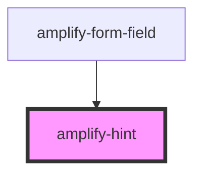

# amplify-hint

<!-- Auto Generated Below -->

## Slots

| Slot          | Description          |
| ------------- | -------------------- |
| `"(default)"` | Content for the hint |

## CSS Custom Properties

| Name            | Description             |
| --------------- | ----------------------- |
| `--color`       | Color of the text       |
| `--font-family` | Font family of the text |
| `--font-size`   | Font size of the text   |
| `--font-weight` | Font weight of the text |

## Dependencies

### Used by

 - [amplify-form-field](../amplify-form-field)

### Graph

----------------------------------------------

*Built with [StencilJS](https://stenciljs.com/)*
