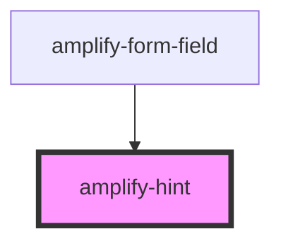

# amplify-hint

<!-- Auto Generated Below -->

## Properties

| Property   | Attribute  | Description | Type      | Default |
| ---------- | ---------- | ----------- | --------- | ------- |
| `override` | `override` |             | `boolean` | `false` |

## Dependencies

### Used by

 - [amplify-form-field](../amplify-form-field)

### Graph

----------------------------------------------

*Built with [StencilJS](https://stenciljs.com/)*
