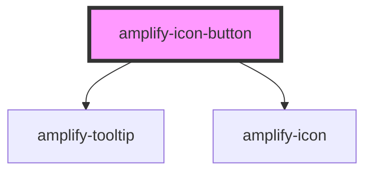

# amplify-icon-button

<!-- Auto Generated Below -->

## Properties

| Property          | Attribute           | Description                                                  | Type                                                                                                                                                                                                                 | Default     |
| ----------------- | ------------------- | ------------------------------------------------------------ | -------------------------------------------------------------------------------------------------------------------------------------------------------------------------------------------------------------------- | ----------- |
| `autoShowTooltip` | `auto-show-tooltip` | (Optional) Whether or not to show the tooltip automatically  | `boolean`                                                                                                                                                                                                            | `false`     |
| `name`            | `name`              | The name of the icon used inside of the button               | `"amazon" \| "auth0" \| "ban" \| "enter-vr" \| "exit-vr" \| "facebook" \| "google" \| "loading" \| "maximize" \| "microphone" \| "minimize" \| "photoPlaceholder" \| "send" \| "sound" \| "sound-mute" \| "warning"` | `undefined` |
| `tooltip`         | `tooltip`           | (Optional) The tooltip that will show on hover of the button | `string`                                                                                                                                                                                                             | `null`      |

## CSS Custom Properties

| Name                        | Description                                      |
| --------------------------- | ------------------------------------------------ |
| `--button-background-hover` | Background color of the button when it's hovered |
| `--button-color`            | Text color of the button                         |

## Dependencies

### Depends on

- [amplify-tooltip](../amplify-tooltip)
- [amplify-icon](../amplify-icon)

### Graph

----------------------------------------------

*Built with [StencilJS](https://stenciljs.com/)*
