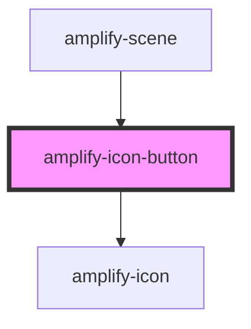

# amplify-icon-button

<!-- Auto Generated Below -->

## Properties

| Property          | Attribute           | Description | Type                                                                             | Default     |
| ----------------- | ------------------- | ----------- | -------------------------------------------------------------------------------- | ----------- |
| `autoShowTooltip` | `auto-show-tooltip` |             | `boolean`                                                                        | `undefined` |
| `name`            | `name`              |             | `"enter-vr" \| "exit-vr" \| "maximize" \| "minimize" \| "sound" \| "sound-mute"` | `undefined` |
| `tooltip`         | `tooltip`           |             | `string`                                                                         | `undefined` |

## Dependencies

### Used by

- [amplify-scene](../amplify-scene)

### Depends on

- [amplify-icon](../amplify-icon)

### Graph

---

_Built with [StencilJS](https://stenciljs.com/)_
