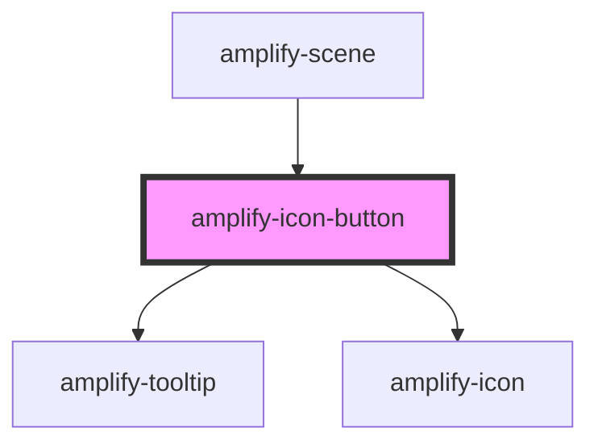

# amplify-icon-button

<!-- Auto Generated Below -->

## Properties

| Property          | Attribute           | Description                         | Type                                                                                                                                                        | Default     |
| ----------------- | ------------------- | ----------------------------------- | ----------------------------------------------------------------------------------------------------------------------------------------------------------- | ----------- |
| `autoShowTooltip` | `auto-show-tooltip` |                                     | `boolean`                                                                                                                                                   | `false`     |
| `name`            | `name`              |                                     | `"amazon" \| "auth0" \| "enter-vr" \| "exit-vr" \| "facebook" \| "google" \| "loading" \| "maximize" \| "minimize" \| "sound" \| "sound-mute" \| "warning"` | `undefined` |
| `overrideStyle`   | `override-style`    | (Optional) Override default styling | `boolean`                                                                                                                                                   | `false`     |
| `tooltip`         | `tooltip`           |                                     | `string`                                                                                                                                                    | `null`      |

## Dependencies

### Used by

 - [amplify-scene](../amplify-scene)

### Depends on

- [amplify-tooltip](../amplify-tooltip)
- [amplify-icon](../amplify-icon)

### Graph

----------------------------------------------

*Built with [StencilJS](https://stenciljs.com/)*
