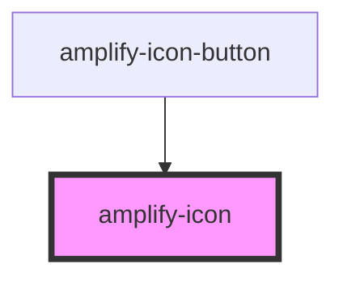

# amplify-icon

<!-- Auto Generated Below -->

## Properties

| Property        | Attribute        | Description                                                 | Type                                                                             | Default     |
| --------------- | ---------------- | ----------------------------------------------------------- | -------------------------------------------------------------------------------- | ----------- |
| `name`          | `name`           | (Required) Name of icon used to determine the icon rendered | `"enter-vr" \| "exit-vr" \| "maximize" \| "minimize" \| "sound" \| "sound-mute"` | `undefined` |
| `overrideStyle` | `override-style` | (Optional) Override default styling                         | `boolean`                                                                        | `false`     |

## Dependencies

### Used by

 - [amplify-icon-button](../amplify-icon-button)

### Graph

----------------------------------------------

*Built with [StencilJS](https://stenciljs.com/)*
