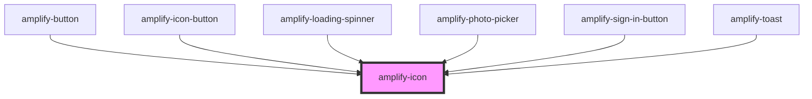

# amplify-icon

<!-- Auto Generated Below -->

## Properties

| Property | Attribute | Description                                                 | Type                                                                                                                                                                                                                 | Default     |
| -------- | --------- | ----------------------------------------------------------- | -------------------------------------------------------------------------------------------------------------------------------------------------------------------------------------------------------------------- | ----------- |
| `name`   | `name`    | (Required) Name of icon used to determine the icon rendered | `"amazon" \| "auth0" \| "ban" \| "enter-vr" \| "exit-vr" \| "facebook" \| "google" \| "loading" \| "maximize" \| "microphone" \| "minimize" \| "photoPlaceholder" \| "send" \| "sound" \| "sound-mute" \| "warning"` | `undefined` |

## CSS Custom Properties

| Name                | Description            |
| ------------------- | ---------------------- |
| `--height`          | Height of the icon     |
| `--icon-fill-color` | Fill color of the icon |
| `--width`           | Width of the icon      |

## Dependencies

### Used by

 - [amplify-button](../amplify-button)
 - [amplify-icon-button](../amplify-icon-button)
 - [amplify-loading-spinner](../amplify-loading-spinner)
 - [amplify-photo-picker](../amplify-photo-picker)
 - [amplify-sign-in-button](../amplify-sign-in-button)
 - [amplify-toast](../amplify-toast)

### Graph

----------------------------------------------

*Built with [StencilJS](https://stenciljs.com/)*
