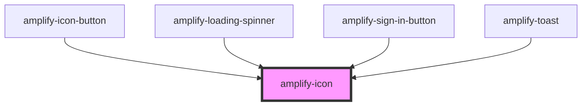

# amplify-icon

<!-- Auto Generated Below -->

## Properties

| Property | Attribute | Description                                                 | Type                                                                                                                                                        | Default     |
| -------- | --------- | ----------------------------------------------------------- | ----------------------------------------------------------------------------------------------------------------------------------------------------------- | ----------- |
| `name`   | `name`    | (Required) Name of icon used to determine the icon rendered | `"amazon" or "auth0" or "enter-vr" or "exit-vr" or "facebook" or "google" or "loading" or "maximize" or "minimize" or "sound" or "sound-mute" or "warning"` | `undefined` |

## Dependencies

### Used by

 - [amplify-icon-button](../amplify-icon-button)
 - [amplify-loading-spinner](../amplify-loading-spinner)
 - [amplify-sign-in-button](../amplify-sign-in-button)
 - [amplify-toast](../amplify-toast)

### Graph

----------------------------------------------

*Built with [StencilJS](https://stenciljs.com/)*
