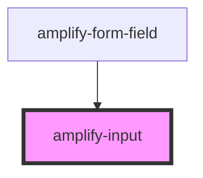

# amplify-input

<!-- Auto Generated Below -->

## Properties

| Property            | Attribute        | Description                                                                                                                                        | Type                                                                                            | Default     |
| ------------------- | ---------------- | -------------------------------------------------------------------------------------------------------------------------------------------------- | ----------------------------------------------------------------------------------------------- | ----------- |
| `description`       | `description`    | The text of the description.  Goes just below the label.                                                                                           | `string`                                                                                        | `undefined` |
| `fieldId`           | `field-id`       | The ID of the field.  Should match with its corresponding input's ID.                                                                              | `string`                                                                                        | `undefined` |
| `handleInputChange` | --               | The callback, called when the input is modified by the user.                                                                                       | `(inputEvent: Event) => void`                                                                   | `undefined` |
| `name`              | `name`           | (Optional) String value for the name of the input.                                                                                                 | `string`                                                                                        | `undefined` |
| `overrideStyle`     | `override-style` | (Optional) Override default styling                                                                                                                | `boolean`                                                                                       | `false`     |
| `placeholder`       | `placeholder`    | (Optional) The placeholder for the input element.  Using hints is recommended, but placeholders can also be useful to convey information to users. | `string`                                                                                        | `''`        |
| `type`              | `type`           | The input type.  Can be any HTML input type.                                                                                                       | `"date" \| "email" \| "number" \| "password" \| "search" \| "tel" \| "text" \| "time" \| "url"` | `'text'`    |
| `value`             | `value`          | The value of the content inside of the input field                                                                                                 | `string`                                                                                        | `undefined` |

## Dependencies

### Used by

 - [amplify-form-field](../amplify-form-field)

### Graph

----------------------------------------------

*Built with [StencilJS](https://stenciljs.com/)*
