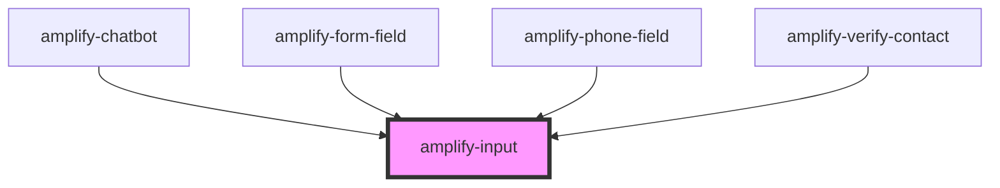

# amplify-input

<!-- Auto Generated Below -->

## Properties

| Property            | Attribute     | Description                                                                                                                                        | Type                                                                                            | Default        |
| ------------------- | ------------- | -------------------------------------------------------------------------------------------------------------------------------------------------- | ----------------------------------------------------------------------------------------------- | -------------- |
| `description`       | `description` | The text of the description.  Goes just below the label.                                                                                           | `string`                                                                                        | `undefined`    |
| `disabled`          | `disabled`    | Will disable the input if set to true                                                                                                              | `boolean`                                                                                       | `undefined`    |
| `fieldId`           | `field-id`    | The ID of the field.  Should match with its corresponding input's ID.                                                                              | `string`                                                                                        | `undefined`    |
| `handleInputChange` | --            | The callback, called when the input is modified by the user.                                                                                       | `(inputEvent: InputEvent) => void`                                                              | `() => void 0` |
| `inputProps`        | --            | Attributes places on the input element: https://developer.mozilla.org/en-US/docs/Web/HTML/Element/input#Attributes                                 | `object`                                                                                        | `undefined`    |
| `name`              | `name`        | (Optional) String value for the name of the input.                                                                                                 | `string`                                                                                        | `undefined`    |
| `placeholder`       | `placeholder` | (Optional) The placeholder for the input element.  Using hints is recommended, but placeholders can also be useful to convey information to users. | `string`                                                                                        | `''`           |
| `required`          | `required`    | Whether the input is a required field                                                                                                              | `boolean`                                                                                       | `false`        |
| `type`              | `type`        | The input type.  Can be any HTML input type.                                                                                                       | `"date" \| "email" \| "number" \| "password" \| "search" \| "tel" \| "text" \| "time" \| "url"` | `'text'`       |
| `value`             | `value`       | The value of the content inside of the input field                                                                                                 | `string`                                                                                        | `undefined`    |

## CSS Custom Properties

| Name                   | Description                               |
| ---------------------- | ----------------------------------------- |
| `--background-color`   | Background color of the input             |
| `--border-color`       | Border color of the input                 |
| `--border-color-focus` | Border color of the input when focused on |
| `--color`              | Text color within the input               |
| `--margin`             | Margin around the input                   |

## Dependencies

### Used by

 - [amplify-chatbot](../amplify-chatbot)
 - [amplify-form-field](../amplify-form-field)
 - [amplify-phone-field](../amplify-phone-field)
 - [amplify-verify-contact](../amplify-verify-contact)

### Graph

----------------------------------------------

*Built with [StencilJS](https://stenciljs.com/)*
