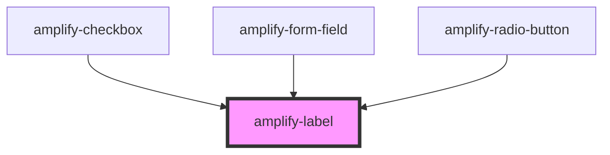

# amplify-label

<!-- Auto Generated Below -->

## Properties

| Property        | Attribute        | Description | Type      | Default     |
| --------------- | ---------------- | ----------- | --------- | ----------- |
| `htmlFor`       | `html-for`       |             | `string`  | `undefined` |
| `styleOverride` | `style-override` |             | `boolean` | `false`     |

## Dependencies

### Used by

 - [amplify-checkbox](../amplify-checkbox)
 - [amplify-form-field](../amplify-form-field)
 - [amplify-radio-button](../amplify-radio-button)

### Graph

----------------------------------------------

*Built with [StencilJS](https://stenciljs.com/)*
