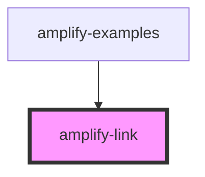

# amplify-link

<!-- Auto Generated Below -->

## Properties

| Property        | Attribute        | Description | Type      | Default        |
| --------------- | ---------------- | ----------- | --------- | -------------- |
| `role`          | `role`           |             | `string`  | `'navigation'` |
| `styleOverride` | `style-override` |             | `boolean` | `false`        |

## Dependencies

### Used by

 - [amplify-examples](../amplify-examples)

### Graph

----------------------------------------------

*Built with [StencilJS](https://stenciljs.com/)*
