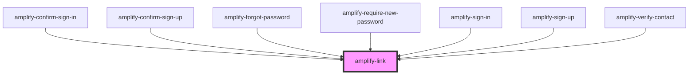

# amplify-link

<!-- Auto Generated Below -->

## Properties

| Property        | Attribute        | Description | Type      | Default        |
| --------------- | ---------------- | ----------- | --------- | -------------- |
| `overrideStyle` | `override-style` |             | `boolean` | `false`        |
| `role`          | `role`           |             | `string`  | `'navigation'` |

## Dependencies

### Used by

 - [amplify-confirm-sign-in](../amplify-confirm-sign-in)
 - [amplify-confirm-sign-up](../amplify-confirm-sign-up)
 - [amplify-forgot-password](../amplify-forgot-password)
 - [amplify-require-new-password](../amplify-require-new-password)
 - [amplify-sign-in](../amplify-sign-in)
 - [amplify-sign-up](../amplify-sign-up)
 - [amplify-verify-contact](../amplify-verify-contact)

### Graph

----------------------------------------------

*Built with [StencilJS](https://stenciljs.com/)*
