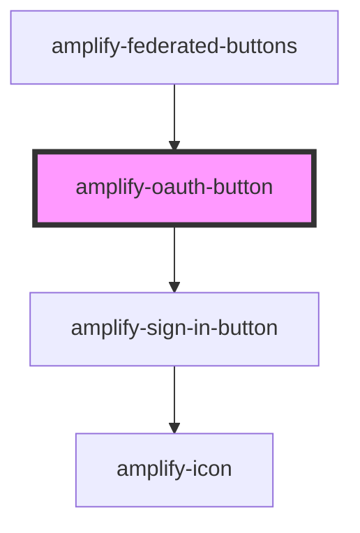

# amplify-oauth-button

<!-- Auto Generated Below -->

## Properties

| Property        | Attribute        | Description                         | Type                      | Default |
| --------------- | ---------------- | ----------------------------------- | ------------------------- | ------- |
| `config`        | --               |                                     | `{ [key: string]: any; }` | `{}`    |
| `overrideStyle` | `override-style` | (Optional) Override default styling | `boolean`                 | `false` |

## Dependencies

### Used by

 - [amplify-federated-buttons](../amplify-federated-buttons)

### Depends on

- [amplify-sign-in-button](../amplify-sign-in-button)

### Graph

----------------------------------------------

*Built with [StencilJS](https://stenciljs.com/)*
