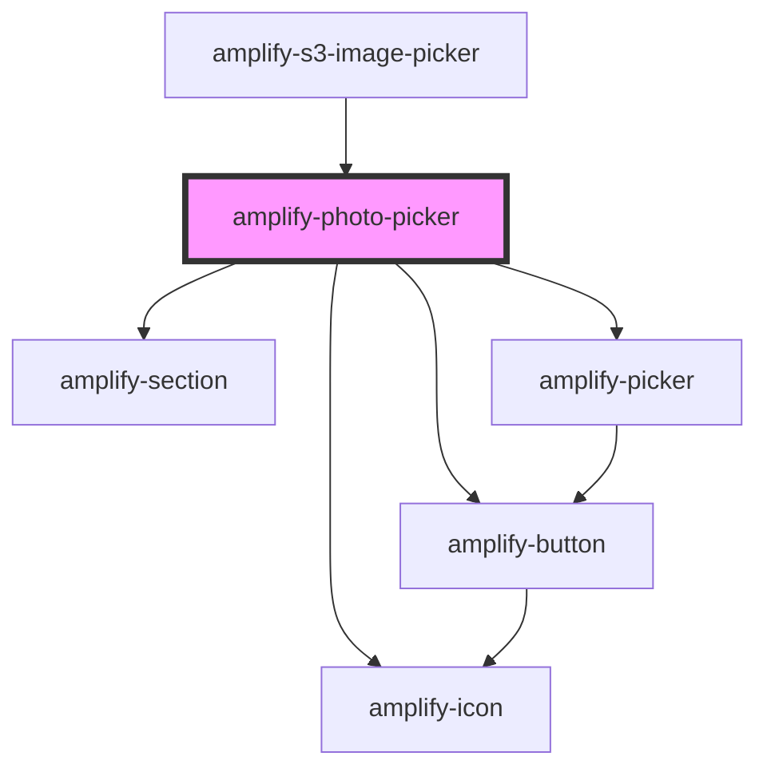

# amplify-photo-picker

<!-- Auto Generated Below -->

## Properties

| Property          | Attribute          | Description                                            | Type                   | Default                                      |
| ----------------- | ------------------ | ------------------------------------------------------ | ---------------------- | -------------------------------------------- |
| `buttonText`      | `button-text`      | Picker button text as string                           | `string`               | `Translations.PHOTO_PICKER_BUTTON_TEXT`      |
| `handleClick`     | --                 | Function that handles file pick onClick                | `(file: File) => void` | `() => {}`                                   |
| `headerHint`      | `header-hint`      | Header Hint value in string                            | `string`               | `Translations.PHOTO_PICKER_HINT`             |
| `headerTitle`     | `header-title`     | Title string value                                     | `string`               | `Translations.PHOTO_PICKER_TITLE`            |
| `placeholderHint` | `placeholder-hint` | Placeholder hint that goes under the placeholder image | `string`               | `Translations.PHOTO_PICKER_PLACEHOLDER_HINT` |
| `previewSrc`      | `preview-src`      | Source of the image to be previewed                    | `object \| string`     | `undefined`                                  |

## Dependencies

### Used by

 - [amplify-s3-image-picker](../amplify-s3-image-picker)

### Depends on

- [amplify-section](../amplify-section)
- [amplify-picker](../amplify-picker)
- [amplify-icon](../amplify-icon)
- [amplify-button](../amplify-button)

### Graph

----------------------------------------------

*Built with [StencilJS](https://stenciljs.com/)*
