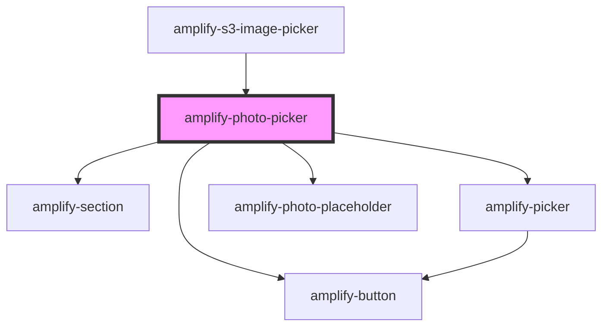

# amplify-photo-picker

<!-- Auto Generated Below -->

## Properties

| Property          | Attribute          | Description | Type                   | Default                                                |
| ----------------- | ------------------ | ----------- | ---------------------- | ------------------------------------------------------ |
| `buttonText`      | `button-text`      |             | `string`               | `I18n.get(Translations.PHOTO_PICKER_BUTTON_TEXT)`      |
| `headerHint`      | `header-hint`      |             | `string`               | `I18n.get(Translations.PHOTO_PICKER_HINT)`             |
| `headerTitle`     | `header-title`     |             | `string`               | `I18n.get(Translations.PHOTO_PICKER_TITLE)`            |
| `onClickHandler`  | --                 |             | `(file: File) => void` | `() => {}`                                             |
| `placeholderHint` | `placeholder-hint` |             | `string`               | `I18n.get(Translations.PHOTO_PICKER_PLACEHOLDER_HINT)` |
| `previewSrc`      | `preview-src`      |             | `object \| string`     | `undefined`                                            |

## Dependencies

### Used by

 - [amplify-s3-image-picker](../amplify-s3-image-picker)

### Depends on

- [amplify-section](../amplify-section)
- [amplify-picker](../amplify-picker)
- [amplify-photo-placeholder](../amplify-photo-placeholder)
- [amplify-button](../amplify-button)

### Graph

----------------------------------------------

*Built with [StencilJS](https://stenciljs.com/)*
