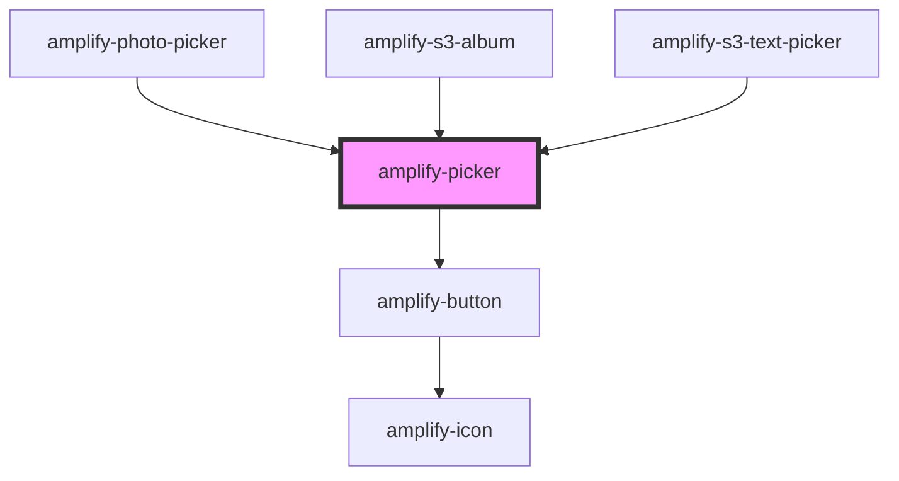

# amplify-picker

<!-- Auto Generated Below -->

## Properties

| Property       | Attribute      | Description                 | Type                 | Default                    |
| -------------- | -------------- | --------------------------- | -------------------- | -------------------------- |
| `acceptValue`  | `accept-value` | File input accept value     | `string`             | `'*/*'`                    |
| `inputHandler` | --             | File input onChange handler | `(e: Event) => void` | `undefined`                |
| `pickerText`   | `picker-text`  | Picker button text          | `string`             | `Translations.PICKER_TEXT` |

## Dependencies

### Used by

 - [amplify-photo-picker](../amplify-photo-picker)
 - [amplify-s3-album](../amplify-s3-album)
 - [amplify-s3-text-picker](../amplify-s3-text-picker)

### Depends on

- [amplify-button](../amplify-button)

### Graph

----------------------------------------------

*Built with [StencilJS](https://stenciljs.com/)*
