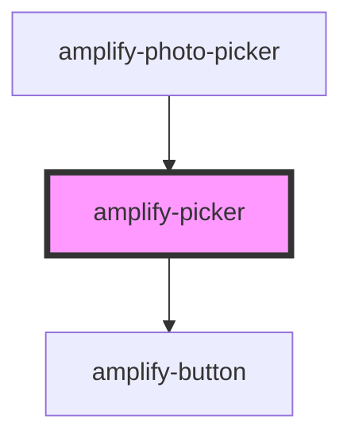

# amplify-picker

<!-- Auto Generated Below -->

## Properties

| Property       | Attribute      | Description | Type                 | Default                              |
| -------------- | -------------- | ----------- | -------------------- | ------------------------------------ |
| `acceptValue`  | `accept-value` |             | `string`             | `'*/*'`                              |
| `inputHandler` | --             |             | `(e: Event) => void` | `undefined`                          |
| `pickerText`   | `picker-text`  |             | `string`             | `I18n.get(Translations.PICKER_TEXT)` |

## Dependencies

### Used by

 - [amplify-photo-picker](../amplify-photo-picker)

### Depends on

- [amplify-button](../amplify-button)

### Graph

----------------------------------------------

*Built with [StencilJS](https://stenciljs.com/)*
