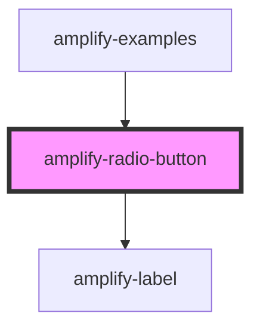

# amplify-radio-button

<!-- Auto Generated Below -->

## Properties

| Property        | Attribute        | Description                                           | Type      | Default     |
| --------------- | ---------------- | ----------------------------------------------------- | --------- | ----------- |
| `fieldId`       | `field-id`       | Field ID used for the 'for' in the label              | `string`  | `undefined` |
| `label`         | `label`          | Label for the radio button                            | `string`  | `undefined` |
| `name`          | `name`           | (optional) Name of radio button                       | `string`  | `undefined` |
| `styleOverride` | `style-override` | (optional) Whether or not to override default styling | `boolean` | `false`     |
| `type`          | `type`           | Type of input for this component is radio             | `string`  | `'radio'`   |
| `value`         | `value`          | (optional) Value of radio button                      | `string`  | `undefined` |

## Dependencies

### Used by

 - [amplify-examples](../amplify-examples)

### Depends on

- [amplify-label](../amplify-label)

### Graph

----------------------------------------------

*Built with [StencilJS](https://stenciljs.com/)*
