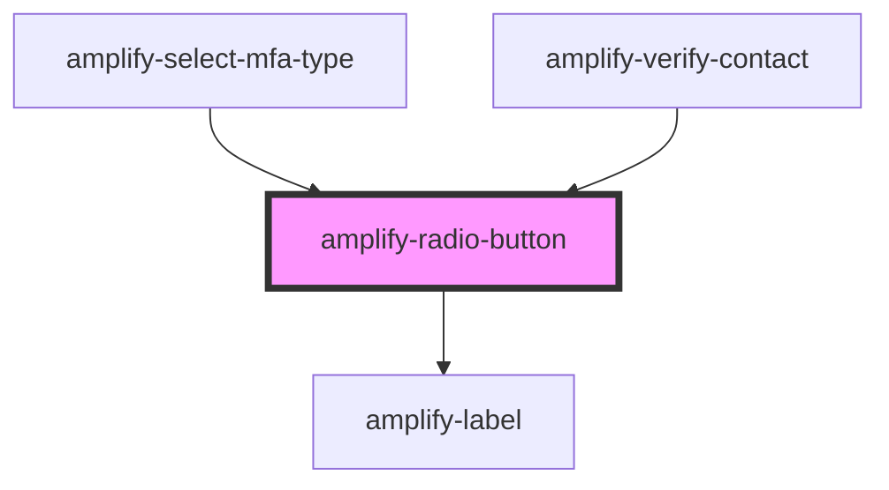

# amplify-radio-button

<!-- Auto Generated Below -->

## Properties

| Property            | Attribute     | Description                                                                                                                                        | Type                          | Default     |
| ------------------- | ------------- | -------------------------------------------------------------------------------------------------------------------------------------------------- | ----------------------------- | ----------- |
| `checked`           | `checked`     | If `true`, the radio button is selected.                                                                                                           | `boolean`                     | `false`     |
| `disabled`          | `disabled`    | If `true`, the checkbox is disabled                                                                                                                | `boolean`                     | `false`     |
| `fieldId`           | `field-id`    | Field ID used for the 'for' in the label                                                                                                           | `string`                      | `undefined` |
| `handleInputChange` | --            | The callback, called when the input is modified by the user.                                                                                       | `(inputEvent: Event) => void` | `undefined` |
| `inputProps`        | --            | Attributes places on the input element: https://developer.mozilla.org/en-US/docs/Web/HTML/Element/input#Attributes                                 | `object`                      | `undefined` |
| `label`             | `label`       | Label for the radio button                                                                                                                         | `string`                      | `undefined` |
| `name`              | `name`        | (Optional) Name of radio button                                                                                                                    | `string`                      | `undefined` |
| `placeholder`       | `placeholder` | (Optional) The placeholder for the input element.  Using hints is recommended, but placeholders can also be useful to convey information to users. | `string`                      | `''`        |
| `value`             | `value`       | (Optional) Value of radio button                                                                                                                   | `string`                      | `undefined` |

## Dependencies

### Used by

 - [amplify-select-mfa-type](../amplify-select-mfa-type)
 - [amplify-verify-contact](../amplify-verify-contact)

### Depends on

- [amplify-label](../amplify-label)

### Graph

----------------------------------------------

*Built with [StencilJS](https://stenciljs.com/)*
