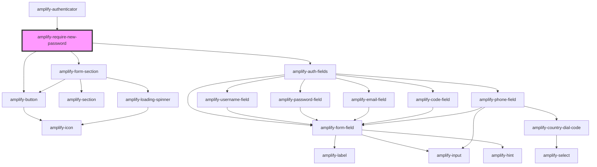

# amplify-require-new-password

<!-- Auto Generated Below -->

## Properties

| Property                | Attribute            | Description                                                  | Type                                                | Default                                                                                                                                                                                                                                                                                                                                     |
| ----------------------- | -------------------- | ------------------------------------------------------------ | --------------------------------------------------- | ------------------------------------------------------------------------------------------------------------------------------------------------------------------------------------------------------------------------------------------------------------------------------------------------------------------------------------------- |
| `formFields`            | --                   | The form fields displayed inside of the forgot password form | `FormFieldTypes`                                    | `[ 		{ 			type: AuthFormField.Password, 			required: true, 			handleInputChange: (event) => this.handlePasswordChange(event), 			label: I18n.get(Translations.NEW_PASSWORD_LABEL), 			placeholder: I18n.get(Translations.NEW_PASSWORD_PLACEHOLDER), 			inputProps: { 				'data-test': 'require-new-password-password-input', 			}, 		}, 	]` |
| `handleAuthStateChange` | --                   | Auth state change handler for this component                 | `(nextAuthState: AuthState, data?: object) => void` | `dispatchAuthStateChangeEvent`                                                                                                                                                                                                                                                                                                              |
| `handleSubmit`          | --                   | The function called when submitting a new password           | `(event: Event) => void`                            | `(event) => 		this.completeNewPassword(event)`                                                                                                                                                                                                                                                                                              |
| `headerText`            | `header-text`        | The header text of the forgot password section               | `string`                                            | `Translations.CHANGE_PASSWORD`                                                                                                                                                                                                                                                                                                              |
| `submitButtonText`      | `submit-button-text` | The text displayed inside of the submit button for the form  | `string`                                            | `Translations.CHANGE_PASSWORD_ACTION`                                                                                                                                                                                                                                                                                                       |
| `user`                  | --                   | Used for the username to be passed to resend code            | `CognitoUserInterface`                              | `undefined`                                                                                                                                                                                                                                                                                                                                 |

## Dependencies

### Used by

 - [amplify-authenticator](../amplify-authenticator)

### Depends on

- [amplify-form-section](../amplify-form-section)
- [amplify-button](../amplify-button)
- [amplify-auth-fields](../amplify-auth-fields)

### Graph

----------------------------------------------

*Built with [StencilJS](https://stenciljs.com/)*
