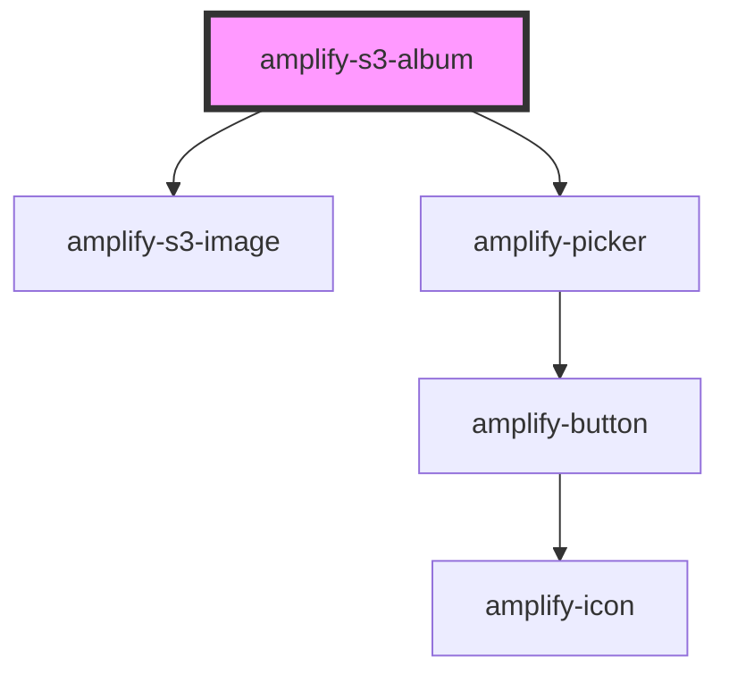

# amplify-s3-album

<!-- Auto Generated Below -->

## Properties

| Property        | Attribute      | Description                                                        | Type                                                                 | Default                    |
| --------------- | -------------- | ------------------------------------------------------------------ | -------------------------------------------------------------------- | -------------------------- |
| `contentType`   | `content-type` | The content type header used when uploading to S3                  | `string`                                                             | `'binary/octet-stream'`    |
| `fileToKey`     | --             | Callback used to generate custom key value                         | `(data: object) => string`                                           | `undefined`                |
| `filter`        | --             | Filter to be applied on album list                                 | `(list: StorageObject[]) => StorageObject[]`                         | `undefined`                |
| `handleOnError` | --             | Function executed when error occurs for the s3-image               | `(event: Event) => void`                                             | `undefined`                |
| `handleOnLoad`  | --             | Function executed when s3-image loads                              | `(event: Event) => void`                                             | `undefined`                |
| `identityId`    | `identity-id`  | Cognito identity id of the another user's image list               | `string`                                                             | `undefined`                |
| `level`         | `level`        | The access level of the files                                      | `AccessLevel.Private \| AccessLevel.Protected \| AccessLevel.Public` | `AccessLevel.Public`       |
| `path`          | `path`         | String representing directory location of image files to be listed | `string`                                                             | `undefined`                |
| `picker`        | `picker`       | Boolean to enable or disable picker                                | `boolean`                                                            | `true`                     |
| `pickerText`    | `picker-text`  | Picker button text                                                 | `string`                                                             | `Translations.PICKER_TEXT` |
| `sort`          | --             | Sort to be applied on album list                                   | `(list: StorageObject[]) => StorageObject[]`                         | `undefined`                |
| `track`         | `track`        | Whether or not to use track the get/put of the listing of images   | `boolean`                                                            | `undefined`                |

## CSS Custom Properties

| Name                 | Description                  |
| -------------------- | ---------------------------- |
| `--overlay-bg-color` | Image overlay color on hover |

## Dependencies

### Depends on

- [amplify-s3-image](../amplify-s3-image)
- [amplify-picker](../amplify-picker)

### Graph

----------------------------------------------

*Built with [StencilJS](https://stenciljs.com/)*
