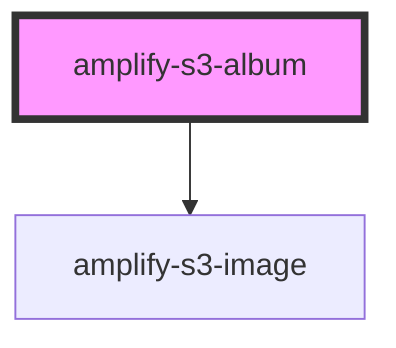

# amplify-s3-album

<!-- Auto Generated Below -->

## Properties

| Property      | Attribute      | Description | Type                                                                 | Default                 |
| ------------- | -------------- | ----------- | -------------------------------------------------------------------- | ----------------------- |
| `contentType` | `content-type` |             | `string`                                                             | `'binary/octet-stream'` |
| `filter`      | `filter`       |             | `any`                                                                | `undefined`             |
| `identityId`  | `identity-id`  |             | `string`                                                             | `undefined`             |
| `level`       | `level`        |             | `AccessLevel.Private \| AccessLevel.Protected \| AccessLevel.Public` | `AccessLevel.Public`    |
| `path`        | `path`         |             | `string`                                                             | `undefined`             |
| `sort`        | `sort`         |             | `any`                                                                | `undefined`             |
| `track`       | `track`        |             | `boolean`                                                            | `undefined`             |

## Dependencies

### Depends on

- [amplify-s3-image](../amplify-s3-image)

### Graph

----------------------------------------------

*Built with [StencilJS](https://stenciljs.com/)*
