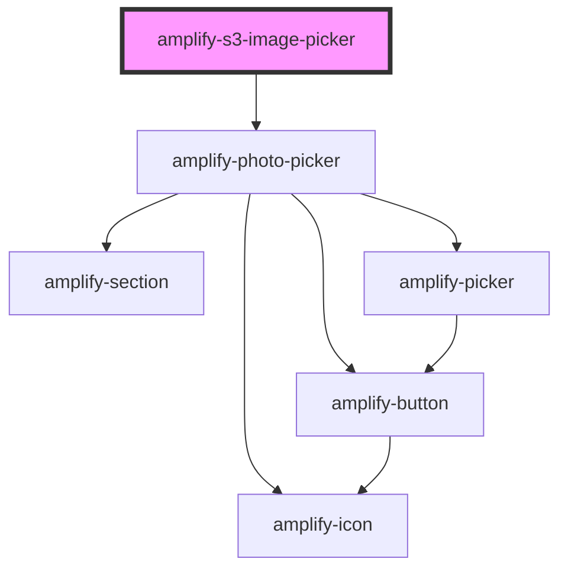

# amplify-s3-image-picker

<!-- Auto Generated Below -->

## Properties

| Property          | Attribute          | Description                                            | Type                                                                 | Default                                      |
| ----------------- | ------------------ | ------------------------------------------------------ | -------------------------------------------------------------------- | -------------------------------------------- |
| `buttonText`      | `button-text`      | Upload Button Text as string                           | `string`                                                             | `Translations.IMAGE_PICKER_BUTTON_TEXT`      |
| `contentType`     | `content-type`     | The content type header used when uploading to S3      | `string`                                                             | `'binary/octet-stream'`                      |
| `fileToKey`       | --                 | Callback used to generate custom key value             | `(data: object) => string`                                           | `undefined`                                  |
| `headerHint`      | `header-hint`      | Header Hint value in string                            | `string`                                                             | `Translations.IMAGE_PICKER_HINT`             |
| `headerTitle`     | `header-title`     | Title string value                                     | `string`                                                             | `Translations.IMAGE_PICKER_TITLE`            |
| `identityId`      | `identity-id`      | Cognito identity id of the another user's image        | `string`                                                             | `undefined`                                  |
| `level`           | `level`            | The access level of the image                          | `AccessLevel.Private \| AccessLevel.Protected \| AccessLevel.Public` | `AccessLevel.Public`                         |
| `path`            | `path`             | String representing directory location to image file   | `string`                                                             | `undefined`                                  |
| `placeholderHint` | `placeholder-hint` | Placeholder hint that goes under the placeholder image | `string`                                                             | `Translations.IMAGE_PICKER_PLACEHOLDER_HINT` |
| `track`           | `track`            | Whether or not to use track the get/put of the image   | `boolean`                                                            | `undefined`                                  |

## Dependencies

### Depends on

- [amplify-photo-picker](../amplify-photo-picker)

### Graph

----------------------------------------------

*Built with [StencilJS](https://stenciljs.com/)*
