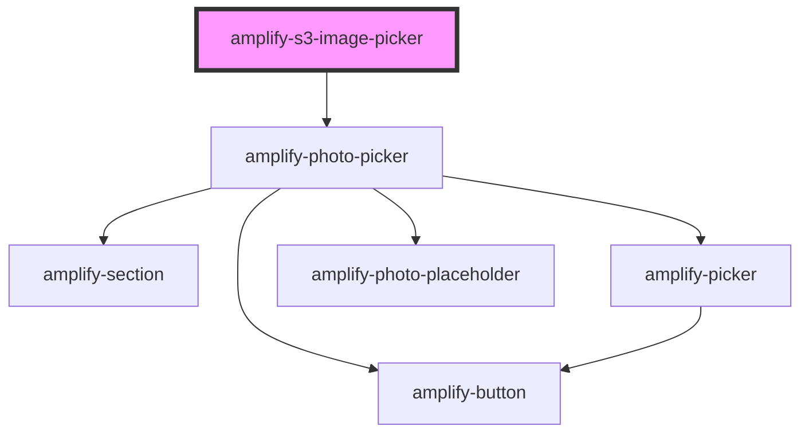

# amplify-s3-image-picker

<!-- Auto Generated Below -->

## Properties

| Property          | Attribute          | Description | Type                                                                 | Default                                                |
| ----------------- | ------------------ | ----------- | -------------------------------------------------------------------- | ------------------------------------------------------ |
| `buttonText`      | `button-text`      |             | `string`                                                             | `I18n.get(Translations.IMAGE_PICKER_BUTTON_TEXT)`      |
| `contentType`     | `content-type`     |             | `string`                                                             | `'binary/octet-stream'`                                |
| `fileToKey`       | --                 |             | `(data: object) => string`                                           | `undefined`                                            |
| `headerHint`      | `header-hint`      |             | `string`                                                             | `I18n.get(Translations.IMAGE_PICKER_HINT)`             |
| `headerTitle`     | `header-title`     |             | `string`                                                             | `I18n.get(Translations.IMAGE_PICKER_TITLE)`            |
| `identityId`      | `identity-id`      |             | `string`                                                             | `undefined`                                            |
| `level`           | `level`            |             | `AccessLevel.Private \| AccessLevel.Protected \| AccessLevel.Public` | `AccessLevel.Public`                                   |
| `path`            | `path`             |             | `string`                                                             | `undefined`                                            |
| `placeholderHint` | `placeholder-hint` |             | `string`                                                             | `I18n.get(Translations.IMAGE_PICKER_PLACEHOLDER_HINT)` |
| `track`           | `track`            |             | `boolean`                                                            | `undefined`                                            |

## Dependencies

### Depends on

- [amplify-photo-picker](../amplify-photo-picker)

### Graph

----------------------------------------------

*Built with [StencilJS](https://stenciljs.com/)*
