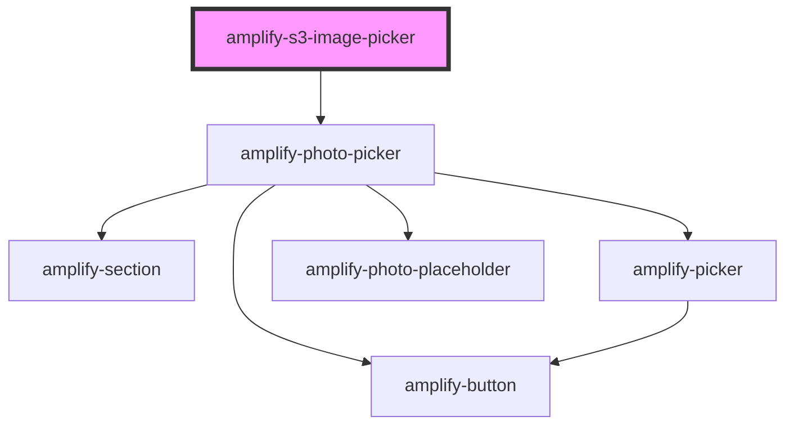

# amplify-s3-image

<!-- Auto Generated Below -->

## Properties

| Property        | Attribute      | Description | Type                                                                 | Default                 |
| --------------- | -------------- | ----------- | -------------------------------------------------------------------- | ----------------------- |
| `body`          | --             |             | `object`                                                             | `undefined`             |
| `contentType`   | `content-type` |             | `string`                                                             | `'binary/octet-stream'` |
| `fileToKey`     | --             |             | `(data: object) => string`                                           | `undefined`             |
| `handleOnError` | --             |             | `(event: Event) => void`                                             | `undefined`             |
| `handleOnLoad`  | --             |             | `(event: Event) => void`                                             | `undefined`             |
| `height`        | `height`       |             | `string`                                                             | `undefined`             |
| `hidden`        | `hidden`       |             | `boolean`                                                            | `false`                 |
| `identityId`    | `identity-id`  |             | `string`                                                             | `undefined`             |
| `imgKey`        | `img-key`      |             | `string`                                                             | `undefined`             |
| `level`         | `level`        |             | `AccessLevel.Private \| AccessLevel.Protected \| AccessLevel.Public` | `AccessLevel.Public`    |
| `path`          | `path`         |             | `string`                                                             | `undefined`             |
| `picker`        | `picker`       |             | `boolean`                                                            | `false`                 |
| `track`         | `track`        |             | `boolean`                                                            | `undefined`             |
| `width`         | `width`        |             | `string`                                                             | `undefined`             |

## Dependencies

### Depends on

- [amplify-photo-picker](../amplify-photo-picker)

### Graph

----------------------------------------------

*Built with [StencilJS](https://stenciljs.com/)*
