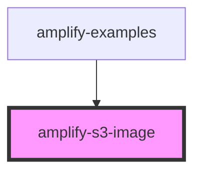

# amplify-s3-image

<!-- Auto Generated Below -->

## Properties

| Property        | Attribute        | Description | Type       | Default     |
| --------------- | ---------------- | ----------- | ---------- | ----------- |
| `handleOnError` | --               |             | `() => {}` | `undefined` |
| `handleOnLoad`  | --               |             | `() => {}` | `undefined` |
| `overrideStyle` | `override-style` |             | `boolean`  | `false`     |
| `pickerEnabled` | `picker-enabled` |             | `boolean`  | `true`      |

## Dependencies

### Used by

 - [amplify-examples](../amplify-examples)

### Graph

----------------------------------------------

*Built with [StencilJS](https://stenciljs.com/)*
