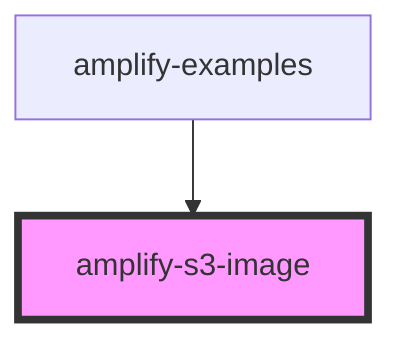

# amplify-s3-image

<!-- Auto Generated Below -->

## Properties

| Property        | Attribute        | Description              | Type                                                                 | Default                 |
| --------------- | ---------------- | ------------------------ | -------------------------------------------------------------------- | ----------------------- |
| `body`          | --               |                          | `object`                                                             | `undefined`             |
| `contentType`   | `content-type`   |                          | `string`                                                             | `'binary/octet-stream'` |
| `handleOnError` | --               |                          | `(event: Event) => void`                                             | `undefined`             |
| `handleOnLoad`  | --               |                          | `(event: Event) => void`                                             | `undefined`             |
| `identityId`    | `identity-id`    |                          | `string`                                                             | `undefined`             |
| `imgKey`        | `img-key`        |                          | `string`                                                             | `undefined`             |
| `level`         | `level`          |                          | `AccessLevel.Private \| AccessLevel.Protected \| AccessLevel.Public` | `AccessLevel.Public`    |
| `overrideStyle` | `override-style` | Override default styling | `boolean`                                                            | `false`                 |
| `path`          | `path`           |                          | `string`                                                             | `undefined`             |
| `pickerEnabled` | `picker-enabled` |                          | `boolean`                                                            | `false`                 |
| `track`         | `track`          |                          | `boolean`                                                            | `undefined`             |

## Dependencies

### Used by

- [amplify-examples](../amplify-examples)

### Graph

---

_Built with [StencilJS](https://stenciljs.com/)_
