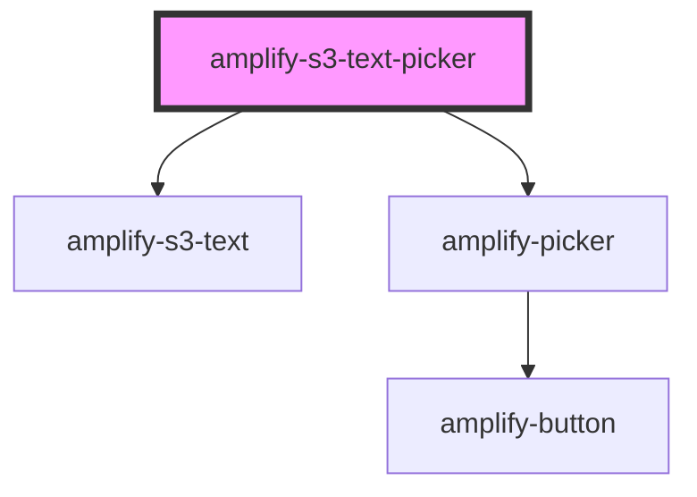

# amplify-s3-text-picker

<!-- Auto Generated Below -->

## Properties

| Property       | Attribute       | Description | Type                                                                 | Default                              |
| -------------- | --------------- | ----------- | -------------------------------------------------------------------- | ------------------------------------ |
| `contentType`  | `content-type`  |             | `string`                                                             | `'text/*'`                           |
| `fallbackText` | `fallback-text` |             | `string`                                                             | `I18n.get(Translations.PICKER_TEXT)` |
| `fileToKey`    | --              |             | `(data: object) => string`                                           | `undefined`                          |
| `identityId`   | `identity-id`   |             | `string`                                                             | `undefined`                          |
| `level`        | `level`         |             | `AccessLevel.Private \| AccessLevel.Protected \| AccessLevel.Public` | `AccessLevel.Public`                 |
| `path`         | `path`          |             | `string`                                                             | `undefined`                          |
| `track`        | `track`         |             | `boolean`                                                            | `undefined`                          |

## Dependencies

### Depends on

- [amplify-s3-text](../amplify-s3-text)
- [amplify-picker](../amplify-picker)

### Graph

----------------------------------------------

*Built with [StencilJS](https://stenciljs.com/)*
