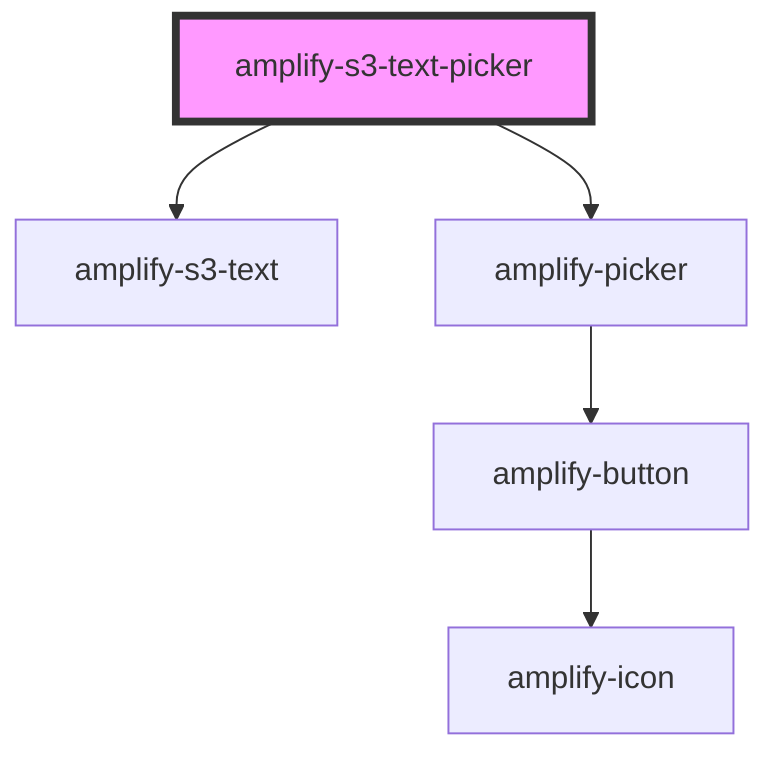

# amplify-s3-text-picker

<!-- Auto Generated Below -->

## Properties

| Property       | Attribute       | Description                                              | Type                                                                 | Default                    |
| -------------- | --------------- | -------------------------------------------------------- | -------------------------------------------------------------------- | -------------------------- |
| `contentType`  | `content-type`  | The content type header used when uploading to S3        | `string`                                                             | `'text/*'`                 |
| `fallbackText` | `fallback-text` | Fallback content for aplify-s3-text                      | `string`                                                             | `Translations.PICKER_TEXT` |
| `fileToKey`    | --              | Callback used to generate custom key value               | `(data: object) => string`                                           | `undefined`                |
| `identityId`   | `identity-id`   | Cognito identity id of the another user's text file      | `string`                                                             | `undefined`                |
| `level`        | `level`         | The access level of the text file                        | `AccessLevel.Private \| AccessLevel.Protected \| AccessLevel.Public` | `AccessLevel.Public`       |
| `path`         | `path`          | String representing directory location to text file      | `string`                                                             | `undefined`                |
| `track`        | `track`         | Whether or not to use track the get/put of the text file | `boolean`                                                            | `undefined`                |

## Dependencies

### Depends on

- [amplify-s3-text](../amplify-s3-text)
- [amplify-picker](../amplify-picker)

### Graph

----------------------------------------------

*Built with [StencilJS](https://stenciljs.com/)*
