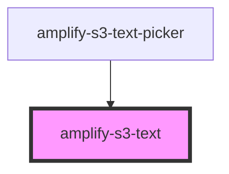

# amplify-s3-text

<!-- Auto Generated Below -->

## Properties

| Property       | Attribute       | Description | Type                                                                 | Default                                        |
| -------------- | --------------- | ----------- | -------------------------------------------------------------------- | ---------------------------------------------- |
| `body`         | --              |             | `object`                                                             | `undefined`                                    |
| `contentType`  | `content-type`  |             | `string`                                                             | `'text/*'`                                     |
| `fallbackText` | `fallback-text` |             | `string`                                                             | `I18n.get(Translations.TEXT_FALLBACK_CONTENT)` |
| `identityId`   | `identity-id`   |             | `string`                                                             | `undefined`                                    |
| `level`        | `level`         |             | `AccessLevel.Private \| AccessLevel.Protected \| AccessLevel.Public` | `AccessLevel.Public`                           |
| `path`         | `path`          |             | `string`                                                             | `undefined`                                    |
| `textKey`      | `text-key`      |             | `string`                                                             | `undefined`                                    |
| `track`        | `track`         |             | `boolean`                                                            | `undefined`                                    |

## Dependencies

### Used by

 - [amplify-s3-text-picker](../amplify-s3-text-picker)

### Graph

----------------------------------------------

*Built with [StencilJS](https://stenciljs.com/)*
