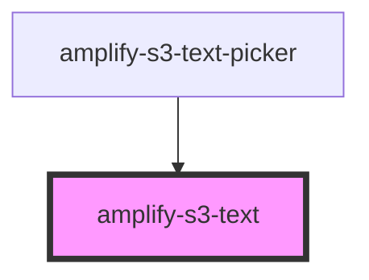

# amplify-s3-text

<!-- Auto Generated Below -->

## Properties

| Property       | Attribute       | Description                                              | Type                                                                 | Default                              |
| -------------- | --------------- | -------------------------------------------------------- | -------------------------------------------------------------------- | ------------------------------------ |
| `body`         | --              | Text body content to be uploaded                         | `object`                                                             | `undefined`                          |
| `contentType`  | `content-type`  | The content type header used when uploading to S3        | `string`                                                             | `'text/*'`                           |
| `fallbackText` | `fallback-text` | Fallback content                                         | `string`                                                             | `Translations.TEXT_FALLBACK_CONTENT` |
| `identityId`   | `identity-id`   | Cognito identity id of the another user's text file      | `string`                                                             | `undefined`                          |
| `level`        | `level`         | The access level of the text file                        | `AccessLevel.Private \| AccessLevel.Protected \| AccessLevel.Public` | `AccessLevel.Public`                 |
| `path`         | `path`          | String representing directory location to text file      | `string`                                                             | `undefined`                          |
| `textKey`      | `text-key`      | The key of the text object in S3                         | `string`                                                             | `undefined`                          |
| `track`        | `track`         | Whether or not to use track the get/put of the text file | `boolean`                                                            | `undefined`                          |

## CSS Custom Properties

| Name                | Description                            |
| ------------------- | -------------------------------------- |
| `--border-color`    | Border color of the text container     |
| `--container-color` | Background color of the text container |
| `--font-size`       | Font size of the text                  |
| `--text-color`      | Font color of the text                 |

## Dependencies

### Used by

 - [amplify-s3-text-picker](../amplify-s3-text-picker)

### Graph

----------------------------------------------

*Built with [StencilJS](https://stenciljs.com/)*
