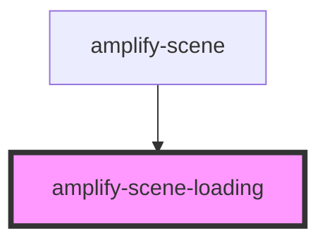

# amplify-scene-loading

<!-- Auto Generated Below -->

## Properties

| Property         | Attribute         | Description | Type                | Default     |
| ---------------- | ----------------- | ----------- | ------------------- | ----------- |
| `loadPercentage` | `load-percentage` |             | `number`            | `0`         |
| `sceneError`     | --                |             | `AmplifySceneError` | `null`      |
| `sceneName`      | `scene-name`      |             | `string`            | `undefined` |

## Dependencies

### Used by

- [amplify-scene](../amplify-scene)

### Graph

---

_Built with [StencilJS](https://stenciljs.com/)_
