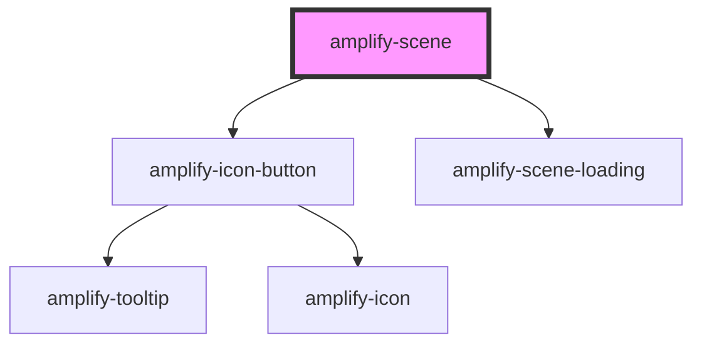

# amplify-scene

<!-- Auto Generated Below -->

## Properties

| Property    | Attribute    | Description | Type     | Default     |
| ----------- | ------------ | ----------- | -------- | ----------- |
| `sceneName` | `scene-name` |             | `string` | `undefined` |

## Dependencies

### Depends on

- [amplify-icon-button](../amplify-icon-button)
- [amplify-scene-loading](../amplify-scene-loading)

### Graph

----------------------------------------------

*Built with [StencilJS](https://stenciljs.com/)*
