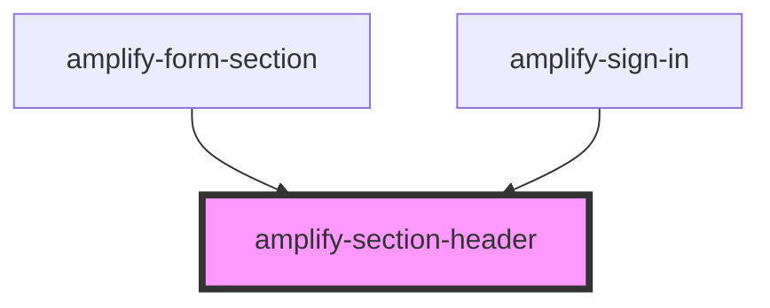

# amplify-section-header

<!-- Auto Generated Below -->

## Properties

| Property        | Attribute        | Description                          | Type      | Default |
| --------------- | ---------------- | ------------------------------------ | --------- | ------- |
| `overrideStyle` | `override-style` | (Optional) Overrides default styling | `boolean` | `false` |

## Dependencies

### Used by

 - [amplify-form-section](../amplify-form-section)
 - [amplify-sign-in](../amplify-sign-in)

### Graph

----------------------------------------------

*Built with [StencilJS](https://stenciljs.com/)*
