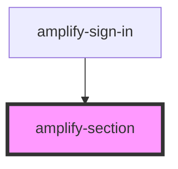

# amplify-section

<!-- Auto Generated Below -->

## Properties

| Property        | Attribute        | Description | Type      | Default         |
| --------------- | ---------------- | ----------- | --------- | --------------- |
| `role`          | `role`           |             | `string`  | `'application'` |
| `styleOverride` | `style-override` |             | `boolean` | `false`         |

## Dependencies

### Used by

 - [amplify-sign-in](../amplify-sign-in)

### Graph

----------------------------------------------

*Built with [StencilJS](https://stenciljs.com/)*
