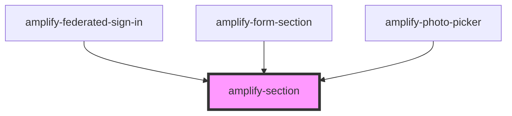

# amplify-section

<!-- Auto Generated Below -->

## Properties

| Property | Attribute | Description                     | Type     | Default         |
| -------- | --------- | ------------------------------- | -------- | --------------- |
| `role`   | `role`    | Equivalent to html section role | `string` | `'application'` |

## Dependencies

### Used by

 - [amplify-federated-sign-in](../amplify-federated-sign-in)
 - [amplify-form-section](../amplify-form-section)
 - [amplify-photo-picker](../amplify-photo-picker)

### Graph

----------------------------------------------

*Built with [StencilJS](https://stenciljs.com/)*
