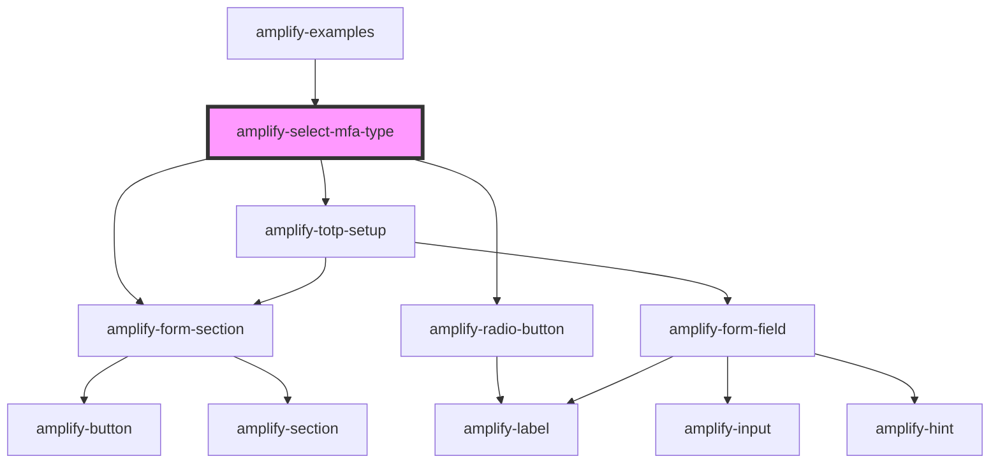

# amplify-totp

<!-- Auto Generated Below -->

## Properties

| Property       | Attribute | Description                                                            | Type                           | Default                                   |
| -------------- | --------- | ---------------------------------------------------------------------- | ------------------------------ | ----------------------------------------- |
| `MFATypes`     | --        | Types of MFA options                                                   | `MFATypesInterface`            | `undefined`                               |
| `authData`     | --        | Current authenticated user in order to sign requests properly for TOTP | `CognitoUserInterface`         | `undefined`                               |
| `handleSubmit` | --        | Fires when Verify is clicked                                           | `(submitEvent: Event) => void` | `submitEvent => this.verify(submitEvent)` |

## Dependencies

### Used by

 - [amplify-examples](../amplify-examples)

### Depends on

- [amplify-form-section](../amplify-form-section)
- [amplify-radio-button](../amplify-radio-button)
- [amplify-totp-setup](../amplify-totp-setup)

### Graph

----------------------------------------------

*Built with [StencilJS](https://stenciljs.com/)*
