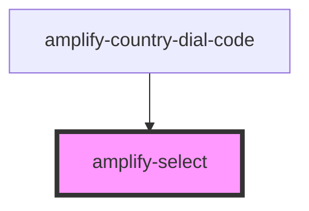

# amplify-select

<!-- Auto Generated Below -->

## Properties

| Property            | Attribute  | Description                                                                                                                 | Type                                             | Default                 |
| ------------------- | ---------- | --------------------------------------------------------------------------------------------------------------------------- | ------------------------------------------------ | ----------------------- |
| `fieldId`           | `field-id` | Used for id field                                                                                                           | `string`                                         | `undefined`             |
| `handleInputChange` | --         | The callback, called when the select is modified by the user.                                                               | `(inputEvent: Event) => void`                    | `undefined`             |
| `options`           | --         | The options of the select input. Must be an Array of Objects with an Object shape of {label: string, value: stringornumber} | `SelectOptions<number> or SelectOptions<string>` | `DEFAULT_SELECT_OPTION` |

## Dependencies

### Used by

 - [amplify-country-dial-code](../amplify-country-dial-code)

### Graph

----------------------------------------------

*Built with [StencilJS](https://stenciljs.com/)*
