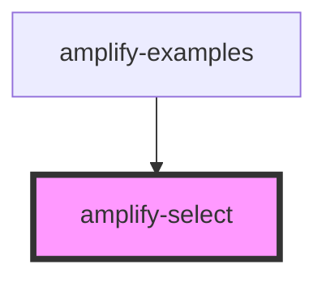

# amplify-select

<!-- Auto Generated Below -->

## Properties

| Property        | Attribute        | Description | Type            | Default     |
| --------------- | ---------------- | ----------- | --------------- | ----------- |
| `options`       | --               |             | `SelectOptions` | `undefined` |
| `styleOverride` | `style-override` |             | `boolean`       | `false`     |

## Dependencies

### Used by

 - [amplify-examples](../amplify-examples)

### Graph

----------------------------------------------

*Built with [StencilJS](https://stenciljs.com/)*
