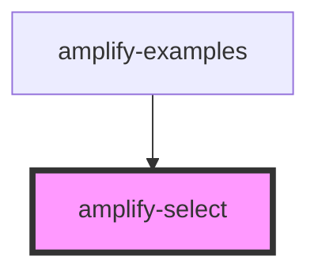

# amplify-select

<!-- Auto Generated Below -->

## Properties

| Property        | Attribute        | Description                                                                                                                 | Type                                             | Default            |
| --------------- | ---------------- | --------------------------------------------------------------------------------------------------------------------------- | ------------------------------------------------ | ------------------ |
| `fieldId`       | `field-id`       | Used for id field                                                                                                           | `string`                                         | `undefined`        |
| `options`       | --               | The options of the select input. Must be an Array of Objects with an Object shape of {label: string, value: string\|number} | `SelectOptions<number> \| SelectOptions<string>` | `countryDialCodes` |
| `styleOverride` | `style-override` | (Optional) Overrides default styling                                                                                        | `boolean`                                        | `false`            |

## Dependencies

### Used by

 - [amplify-examples](../amplify-examples)

### Graph

----------------------------------------------

*Built with [StencilJS](https://stenciljs.com/)*
