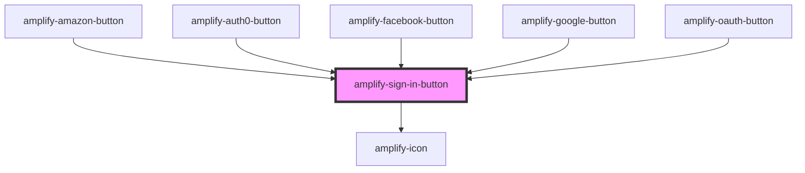

# amplify-sign-in-button

<!-- Auto Generated Below -->

## Properties

| Property   | Attribute  | Description                        | Type                                                       | Default     |
| ---------- | ---------- | ---------------------------------- | ---------------------------------------------------------- | ----------- |
| `provider` | `provider` | Specifies the federation provider. | `"amazon" \| "auth0" \| "facebook" \| "google" \| "oauth"` | `undefined` |

## Slots

| Slot          | Description                      |
| ------------- | -------------------------------- |
| `"(default)"` | Content placed inside the button |

## Dependencies

### Used by

 - [amplify-amazon-button](../amplify-amazon-button)
 - [amplify-auth0-button](../amplify-auth0-button)
 - [amplify-facebook-button](../amplify-facebook-button)
 - [amplify-google-button](../amplify-google-button)
 - [amplify-oauth-button](../amplify-oauth-button)

### Depends on

- [amplify-icon](../amplify-icon)

### Graph

----------------------------------------------

*Built with [StencilJS](https://stenciljs.com/)*
