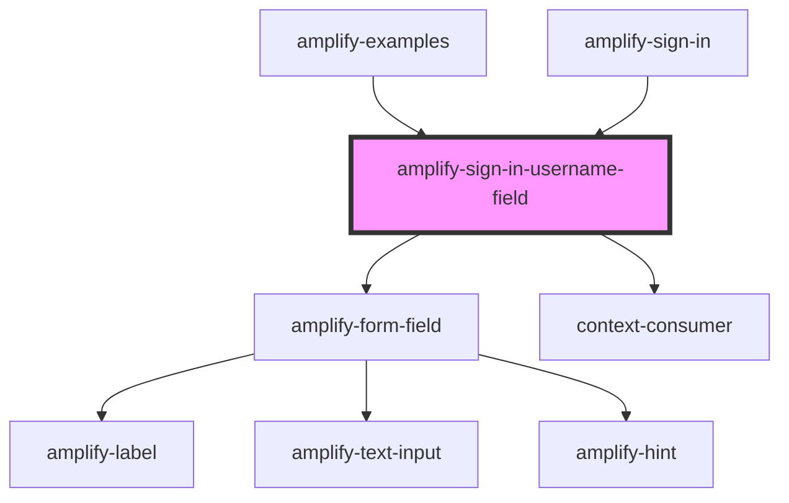

# amplify-sign-in-username-field

<!-- Auto Generated Below -->

## Properties

| Property      | Attribute     | Description | Type                                                  | Default                      |
| ------------- | ------------- | ----------- | ----------------------------------------------------- | ---------------------------- |
| `component`   | --            |             | `Function`                                            | `undefined`                  |
| `description` | `description` |             | `string`                                              | `'Insert your username'`     |
| `fieldId`     | `field-id`    |             | `string`                                              | `'amplify-sign-in-username'` |
| `hint`        | `hint`        |             | `string`                                              | `'Username hint'`            |
| `inputProps`  | --            |             | `{ type?: string; onChange?: (Event: any) => void; }` | `{}`                         |
| `label`       | `label`       |             | `string`                                              | `'Username'`                 |

## Dependencies

### Used by

 - [amplify-examples](../amplify-examples)
 - [amplify-sign-in](../amplify-sign-in)

### Depends on

- [amplify-form-field](../amplify-form-field)
- context-consumer

### Graph

----------------------------------------------

*Built with [StencilJS](https://stenciljs.com/)*
