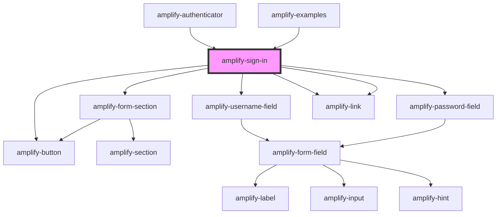

# amplify-sign-in

<!-- Auto Generated Below -->

## Properties

| Property             | Attribute              | Description                                                     | Type                                    | Default                |
| -------------------- | ---------------------- | --------------------------------------------------------------- | --------------------------------------- | ---------------------- |
| `createAccountText`  | `create-account-text`  | Used for the create account text in sign in component           | `string`                                | `CREATE_ACCOUNT_TEXT`  |
| `fieldIdText`        | `field-id-text`        | Based on the type of field e.g. sign-in                         | `"password" \| "sign-in" \| "username"` | `'sign-in'`            |
| `forgotPasswordText` | `forgot-password-text` | Used for the forgot password text in sign in component          | `string`                                | `FORGOT_PASSWORD_TEXT` |
| `handleSubmit`       | --                     | Fires when sign in form is submitted                            | `(Event: any) => void`                  | `undefined`            |
| `headerText`         | `header-text`          | Used for header text in sign in component                       | `string`                                | `HEADER_TEXT`          |
| `noAccountText`      | `no-account-text`      | Used for the no account text in sign in component               | `string`                                | `NO_ACCOUNT_TEXT`      |
| `overrideStyle`      | `override-style`       | (Optional) Overrides default styling                            | `boolean`                               | `false`                |
| `resetPasswordText`  | `reset-password-text`  | Used for the reset password text in sign in component           | `string`                                | `RESET_PASSWORD_TEXT`  |
| `submitButtonText`   | `submit-button-text`   | Used for the submit button text in sign in component            | `string`                                | `SUBMIT_BUTTON_TEXT`   |
| `validationErrors`   | `validation-errors`    | Engages when invalid actions occur, such as missing field, etc. | `string`                                | `undefined`            |

## Dependencies

### Used by

 - [amplify-authenticator](../amplify-authenticator)
 - [amplify-examples](../amplify-examples)

### Depends on

- [amplify-form-section](../amplify-form-section)
- [amplify-username-field](../amplify-username-field)
- [amplify-password-field](../amplify-password-field)
- [amplify-link](../amplify-link)
- [amplify-link](../amplify-link)
- [amplify-button](../amplify-button)

### Graph

----------------------------------------------

*Built with [StencilJS](https://stenciljs.com/)*
