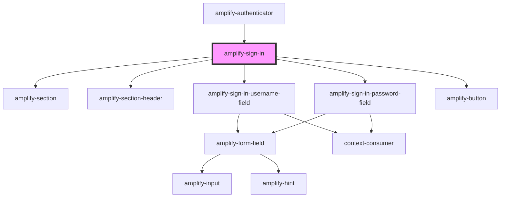

# amplify-sign-in

<!-- Auto Generated Below -->

## Properties

| Property           | Attribute           | Description | Type                   | Default     |
| ------------------ | ------------------- | ----------- | ---------------------- | ----------- |
| `handleSubmit`     | --                  |             | `(Event: any) => void` | `undefined` |
| `validationErrors` | `validation-errors` |             | `string`               | `undefined` |

## Dependencies

### Used by

 - [amplify-authenticator](../amplify-authenticator)

### Depends on

- [amplify-section](../amplify-section)
- [amplify-section-header](../amplify-section-header)
- [amplify-sign-in-username-field](../amplify-sign-in-username-field)
- [amplify-sign-in-password-field](../amplify-sign-in-password-field)
- [amplify-button](../amplify-button)

### Graph

----------------------------------------------

*Built with [StencilJS](https://stenciljs.com/)*
