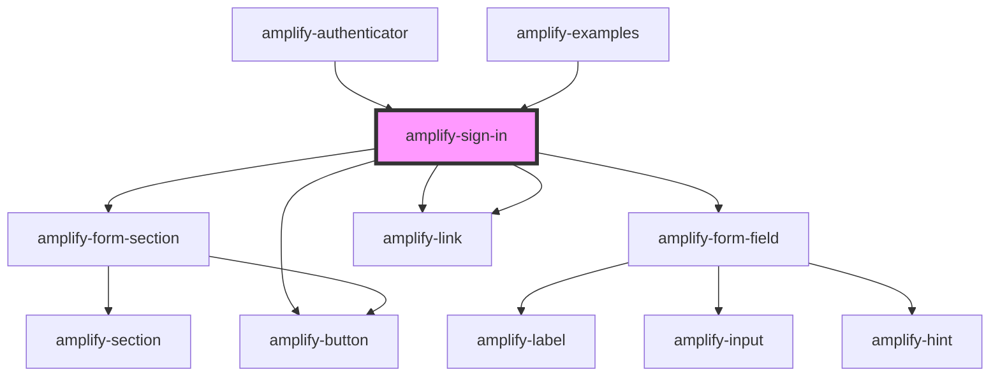

# amplify-sign-in

<!-- Auto Generated Below -->

## Properties

| Property           | Attribute           | Description                                                     | Type                   | Default     |
| ------------------ | ------------------- | --------------------------------------------------------------- | ---------------------- | ----------- |
| `handleSubmit`     | --                  | Fires when sign in form is submitted                            | `(Event: any) => void` | `undefined` |
| `overrideStyle`    | `override-style`    | (Optional) Overrides default styling                            | `boolean`              | `false`     |
| `validationErrors` | `validation-errors` | Engages when invalid actions occur, such as missing field, etc. | `string`               | `undefined` |

## Dependencies

### Used by

 - [amplify-authenticator](../amplify-authenticator)
 - [amplify-examples](../amplify-examples)

### Depends on

- [amplify-form-section](../amplify-form-section)
- [amplify-form-field](../amplify-form-field)
- [amplify-link](../amplify-link)
- [amplify-link](../amplify-link)
- [amplify-button](../amplify-button)

### Graph

----------------------------------------------

*Built with [StencilJS](https://stenciljs.com/)*
