# amplify-sign-in

<!-- Auto Generated Below -->


## Properties

| Property                | Attribute            | Description                                                                                                                                                                                                                                                                                                                                                                                                                                                                                                                           | Type                                                | Default                            |
| ----------------------- | -------------------- | ------------------------------------------------------------------------------------------------------------------------------------------------------------------------------------------------------------------------------------------------------------------------------------------------------------------------------------------------------------------------------------------------------------------------------------------------------------------------------------------------------------------------------------- | --------------------------------------------------- | ---------------------------------- |
| `federated`             | --                   | Federated credentials & configuration.                                                                                                                                                                                                                                                                                                                                                                                                                                                                                                | `FederatedConfig`                                   | `undefined`                        |
| `formFields`            | --                   | Form fields allows you to utilize our pre-built components such as username field, code field, password field, email field, etc. by passing an array of strings that you would like the order of the form to be in. If you need more customization, such as changing text for a label or adjust a placeholder, you can follow the structure below in order to do just that. ``` [   {     type: string,     label: string,     placeholder: string,     hint: string \| Functional Component \| null,     required: boolean   } ] ``` | `FormFieldTypes \| string[]`                        | `[]`                               |
| `handleAuthStateChange` | --                   | Auth state change handler for this component                                                                                                                                                                                                                                                                                                                                                                                                                                                                                          | `(nextAuthState: AuthState, data?: object) => void` | `dispatchAuthStateChangeEvent`     |
| `handleSubmit`          | --                   | Fires when sign in form is submitted                                                                                                                                                                                                                                                                                                                                                                                                                                                                                                  | `(event: Event) => void`                            | `event => this.signIn(event)`      |
| `headerText`            | `header-text`        | Used for header text in sign in component                                                                                                                                                                                                                                                                                                                                                                                                                                                                                             | `string`                                            | `Translations.SIGN_IN_HEADER_TEXT` |
| `hideSignUp`            | `hide-sign-up`       | Hides the sign up link                                                                                                                                                                                                                                                                                                                                                                                                                                                                                                                | `boolean`                                           | `false`                            |
| `submitButtonText`      | `submit-button-text` | Used for the submit button text in sign in component                                                                                                                                                                                                                                                                                                                                                                                                                                                                                  | `string`                                            | `Translations.SIGN_IN_ACTION`      |
| `usernameAlias`         | `username-alias`     | Username Alias is used to setup authentication with `username`, `email` or `phone_number`                                                                                                                                                                                                                                                                                                                                                                                                                                             | `"email" \| "phone_number" \| "username"`           | `'username'`                       |


## Slots

| Slot                         | Description                                                   |
| ---------------------------- | ------------------------------------------------------------- |
| `"federated-buttons"`        | Content above form fields used for sign in federation buttons |
| `"footer"`                   | Content is place in the footer of the component               |
| `"header-subtitle"`          | Subtitle content placed below header text                     |
| `"primary-footer-content"`   | Content placed on the right side of the footer                |
| `"secondary-footer-content"` | Content placed on the left side of the footer                 |


## CSS Custom Properties

| Name                   | Description               |
| ---------------------- | ------------------------- |
| `--footer-color`       | Font color of the footer  |
| `--footer-font-family` | Font family of the footer |
| `--footer-font-size`   | Font size of the footer   |
| `--footer-weight`      | Font weight of the footer |


## Dependencies

### Used by

 - [amplify-authenticator](../amplify-authenticator)

### Depends on

- [amplify-button](../amplify-button)
- [amplify-form-section](../amplify-form-section)
- [amplify-federated-buttons](../amplify-federated-buttons)
- [amplify-strike](../amplify-strike)
- [amplify-auth-fields](../amplify-auth-fields)
- [amplify-loading-spinner](../amplify-loading-spinner)

### Graph

```mermaid
graph TD;
  amplify-sign-in --> amplify-button
  amplify-sign-in --> amplify-form-section
  amplify-sign-in --> amplify-federated-buttons
  amplify-sign-in --> amplify-strike
  amplify-sign-in --> amplify-auth-fields
  amplify-sign-in --> amplify-loading-spinner
  amplify-button --> amplify-icon
  amplify-form-section --> amplify-section
  amplify-form-section --> amplify-button
  amplify-form-section --> amplify-loading-spinner
  amplify-loading-spinner --> amplify-icon
  amplify-federated-buttons --> amplify-google-button
  amplify-federated-buttons --> amplify-facebook-button
  amplify-federated-buttons --> amplify-amazon-button
  amplify-federated-buttons --> amplify-oauth-button
  amplify-federated-buttons --> amplify-auth0-button
  amplify-google-button --> amplify-sign-in-button
  amplify-sign-in-button --> amplify-icon
  amplify-facebook-button --> amplify-sign-in-button
  amplify-amazon-button --> amplify-sign-in-button
  amplify-oauth-button --> amplify-sign-in-button
  amplify-auth0-button --> amplify-sign-in-button
  amplify-auth-fields --> amplify-username-field
  amplify-auth-fields --> amplify-password-field
  amplify-auth-fields --> amplify-email-field
  amplify-auth-fields --> amplify-code-field
  amplify-auth-fields --> amplify-phone-field
  amplify-auth-fields --> amplify-form-field
  amplify-username-field --> amplify-form-field
  amplify-form-field --> amplify-label
  amplify-form-field --> amplify-input
  amplify-form-field --> amplify-hint
  amplify-password-field --> amplify-form-field
  amplify-email-field --> amplify-form-field
  amplify-code-field --> amplify-form-field
  amplify-phone-field --> amplify-form-field
  amplify-phone-field --> amplify-country-dial-code
  amplify-phone-field --> amplify-input
  amplify-country-dial-code --> amplify-select
  amplify-authenticator --> amplify-sign-in
  style amplify-sign-in fill:#f9f,stroke:#333,stroke-width:4px
```


----------------------------------------------

*Built with [StencilJS](https://stenciljs.com/)*
