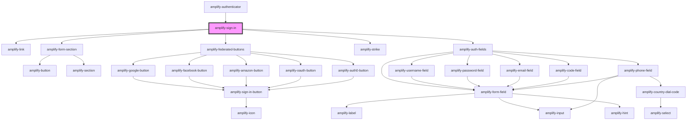

# amplify-sign-in

<!-- Auto Generated Below -->


## Properties

| Property                | Attribute            | Description                                                                                                                                                                                                                                                                                                                                                                                                                                                                                                                                                                       | Type                                                | Default                       |
| ----------------------- | -------------------- | --------------------------------------------------------------------------------------------------------------------------------------------------------------------------------------------------------------------------------------------------------------------------------------------------------------------------------------------------------------------------------------------------------------------------------------------------------------------------------------------------------------------------------------------------------------------------------- | --------------------------------------------------- | ----------------------------- |
| `federated`             | --                   | Federated credentials & configuration.                                                                                                                                                                                                                                                                                                                                                                                                                                                                                                                                            | `FederatedConfig`                                   | `undefined`                   |
| `formFields`            | --                   | Form fields allows you to utilize our pre-built components such as username field, code field, password field, email field, etc. by passing an array of strings that you would like the order of the form to be in. If you need more customization, such as changing text for a label or adjust a placeholder, you can follow the structure below in order to do just that. ``` [   {     type: 'username'\|'password'\|'email'\|'code'\|'default',     label: string,     placeholder: string,     hint: string \| Functional Component \| null,     required: boolean   } ] ``` | `FormFieldTypes \| string[]`                        | `undefined`                   |
| `handleAuthStateChange` | --                   | Passed from the Authenticator component in order to change Authentication state                                                                                                                                                                                                                                                                                                                                                                                                                                                                                                   | `(nextAuthState: AuthState, data?: object) => void` | `undefined`                   |
| `handleSubmit`          | --                   | Fires when sign in form is submitted                                                                                                                                                                                                                                                                                                                                                                                                                                                                                                                                              | `(Event: Event) => void`                            | `event => this.signIn(event)` |
| `headerText`            | `header-text`        | Used for header text in sign in component                                                                                                                                                                                                                                                                                                                                                                                                                                                                                                                                         | `string`                                            | `HEADER_TEXT`                 |
| `overrideStyle`         | `override-style`     | (Optional) Overrides default styling                                                                                                                                                                                                                                                                                                                                                                                                                                                                                                                                              | `boolean`                                           | `false`                       |
| `submitButtonText`      | `submit-button-text` | Used for the submit button text in sign in component                                                                                                                                                                                                                                                                                                                                                                                                                                                                                                                              | `string`                                            | `SUBMIT_BUTTON_TEXT`          |
| `validationErrors`      | `validation-errors`  | Engages when invalid actions occur, such as missing field, etc.                                                                                                                                                                                                                                                                                                                                                                                                                                                                                                                   | `string`                                            | `undefined`                   |


## Dependencies

### Used by

 - [amplify-authenticator](../amplify-authenticator)

### Depends on

- [amplify-link](../amplify-link)
- [amplify-form-section](../amplify-form-section)
- [amplify-federated-buttons](../amplify-federated-buttons)
- [amplify-strike](../amplify-strike)
- [amplify-auth-fields](../amplify-auth-fields)

### Graph


----------------------------------------------

*Built with [StencilJS](https://stenciljs.com/)*
