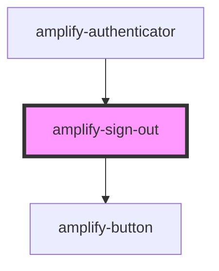

# amplify-sign-out

<!-- Auto Generated Below -->

## Properties

| Property                | Attribute        | Description                                                                      | Type                                                | Default     |
| ----------------------- | ---------------- | -------------------------------------------------------------------------------- | --------------------------------------------------- | ----------- |
| `buttonText`            | `button-text`    | Text inside of the Sign Out button                                               | `string`                                            | `SIGN_OUT`  |
| `handleAuthStateChange` | --               | Passed from the Authenticatior component in order to change Authentication state | `(nextAuthState: AuthState, data?: object) => void` | `undefined` |
| `overrideStyle`         | `override-style` | (Optional) Overrides default styling                                             | `boolean`                                           | `false`     |

## Dependencies

### Used by

 - [amplify-authenticator](../amplify-authenticator)

### Depends on

- [amplify-button](../amplify-button)

### Graph

----------------------------------------------

*Built with [StencilJS](https://stenciljs.com/)*
