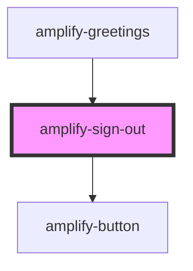

# amplify-sign-out

<!-- Auto Generated Below -->

## Properties

| Property                | Attribute     | Description                                  | Type                                                | Default                        |
| ----------------------- | ------------- | -------------------------------------------- | --------------------------------------------------- | ------------------------------ |
| `buttonText`            | `button-text` | Text inside of the Sign Out button           | `string`                                            | `Translations.SIGN_OUT`        |
| `handleAuthStateChange` | --            | Auth state change handler for this component | `(nextAuthState: AuthState, data?: object) => void` | `dispatchAuthStateChangeEvent` |

## Dependencies

### Used by

 - [amplify-greetings](../amplify-greetings)

### Depends on

- [amplify-button](../amplify-button)

### Graph

----------------------------------------------

*Built with [StencilJS](https://stenciljs.com/)*
